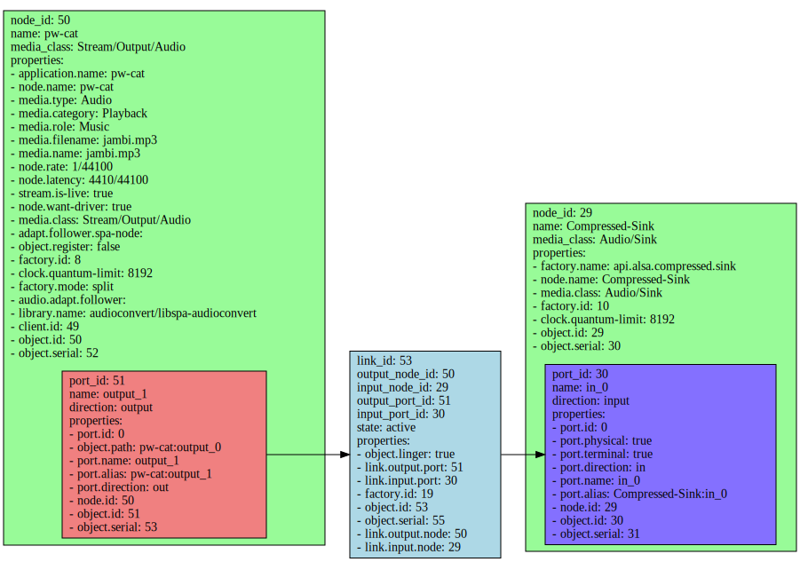

meta-asymptotic
================================

Introduction
-------------------------

This OpenEmbedded/Yocto Project layer is for testing Pipewire with ALSA
compressed offload support on Dragonboard 845c/RB3 platform.

The meta-asymptotic layer primarily depends on:

	URI: https://github.com/96boards/meta-rpb
	layers: meta-rpb
	branch: kirkstone

	URI: http://git.yoctoproject.org/git/meta-qcom
	layers: meta-qcom
	branch: kirkstone

Please follow the recommended setup procedures for Yocto/OpenEmbedded.

Notes
-------------------------

Below is the complete list of layers expected in `bblayers.conf`.

```
meta
meta-poky
meta-yocto-bsp
meta-qcom
meta-openembedded/meta-oe
meta-openembedded/meta-python
meta-openembedded/meta-filesystems
meta-openembedded/meta-networking
meta-openembedded/meta-multimedia
meta-virtualization
meta-selinux
meta-96boards
meta-rpb
meta-asymptotic
```

Before building the image, add the following to `local.conf`.

```
DISTRO = "asymptotic"
```

The image to build is `rpb-console-image`. We `.bbappend` this image to add
additional packages.

Testing compressed offload on RB3/Dragonboard 845c
-------------------------

Check if the sound devices show up.

```
root@dragonboard-845c:~# ls /dev/snd
by-path  comprC0D3  controlC0  pcmC0D0c  pcmC0D0p  pcmC0D1c  pcmC0D1p  pcmC0D2c  pcmC0D2p  timer
```

Disable `pipewire` and `wireplumber` from starting by default.

```bash
systemctl disable pipewire
systemctl disable wireplumber
```

Execute UCM configuration.

```bash
# alsaucm -n -b - <<EOM
open sdm845
set _verb HiFi
list _devices
EOM
```

For compressed node to use `cplay`

```bash
amixer cset name='SLIMBUS_0_RX Audio Mixer MultiMedia4' 1
```

For PCM Playback to use `aplay`

```bash
amixer cset name='SLIMBUS_0_RX Audio Mixer MultiMedia1' 1
amixer cset name='SLIMBUS_0_RX Audio Mixer MultiMedia2' 1
amixer cset name='SLIMBUS_0_RX Audio Mixer MultiMedia3' 1
```

Test basic playback is working on RB3.

```bash
aplay -D hw:0,0 Front_Center.wav
cplay -c 0 -d 3 jambi.mp3
```

Now start `pipewire` and `wireplumber`.

```bash
systemctl start pipewire
systemctl start wireplumber
```

To test compressed offload with `pipewire` and `pw-cat`, on one terminal execute

```bash
pw-cat -o -p jambi.mp3 --target 0
```

and on another

```bash
pw-link pw-cat Compressed-Sink
```

To test compressed offload with `pipewire` and `GStreamer`, on one terminal execute

```bash
gst-launch-1.0 filesrc location=jambi.mp3 ! mpegaudioparse ! pipewiresink mode=2 target-object=Compressed-Sink
```

and on another

```bash
pw-link gst-launch-1.0 Compressed-Sink
```

Testing FLAC
-------------------------

For FLAC, these 3 services are needed.

```bash
systemctl status adsprpcd.service
systemctl status cdsprpcd.service
systemctl status usr-lib-rfsa.service
```

These services are needed for dynamic module loading of the FLAC decoder to DSP.

The `usr-lib-rfsa` service sometimes fails.

```bash
root@dragonboard-845c:~# systemctl status usr-lib-rfsa
* usr-lib-rfsa.service - Mount DSP partition to /usr/lib/rfsa
     Loaded: loaded (8;;file://dragonboard-845c/lib/systemd/system/usr-lib-rfsa.service/lib/systemd/system/usr-lib-rfsa.service8;;; enabled; preset: enabled)
     Active: active (exited) since Mon 2022-08-08 09:10:02 UTC; 25min ago
    Process: 219 ExecStart=/usr/sbin/mount-dsp.sh (code=exited, status=0/SUCCESS)
   Main PID: 219 (code=exited, status=0/SUCCESS)

Aug 08 09:10:02 dragonboard-845c mount-dsp.sh[219]: Not mounting /usr/lib/rfsa, partition/image not found
Aug 08 09:10:02 dragonboard-845c systemd[1]: Finished Mount DSP partition to /usr/lib/rfsa.
```

Before trying to restart the service, an unmount operation is needed.

```bash
umount /dev/sde9
systemctl restart usr-lib-rfsa.
```

Use the `fcplay` utility to play FLAC file.

```bash
root@dragonboard-845c:~# fcplay -c 0 -d 3 -I FLAC sample4.flac
Stream:0 is audio type
Playing file sample4.flac On Card 0 device 3, with buffer of 0 bytes
Format 10 Channels 2, 44100 Hz, Bit Rate 712812
Finish Playing.... Close Normally
```

To test compressed offload with `pipewire`, on one terminal execute

```bash
pw-cat -o -p sample.flac --target 0
```

and on another

```bash
pw-link pw-cat Compressed-Sink
```

To test compressed offload with `pipewire` and `GStreamer`, on one terminal execute

```bash
gst-launch-1.0 filesrc location=sample.flac ! flacparse ! pipewiresink mode=2 target-object=Compressed-Sink
```

and on another

```bash
pw-link gst-launch-1.0 Compressed-Sink
```

Dot graph
-------------------------



Maintainers
-------------------------

* Sanchayan Maity <sanchayan@asymptotic.io>
